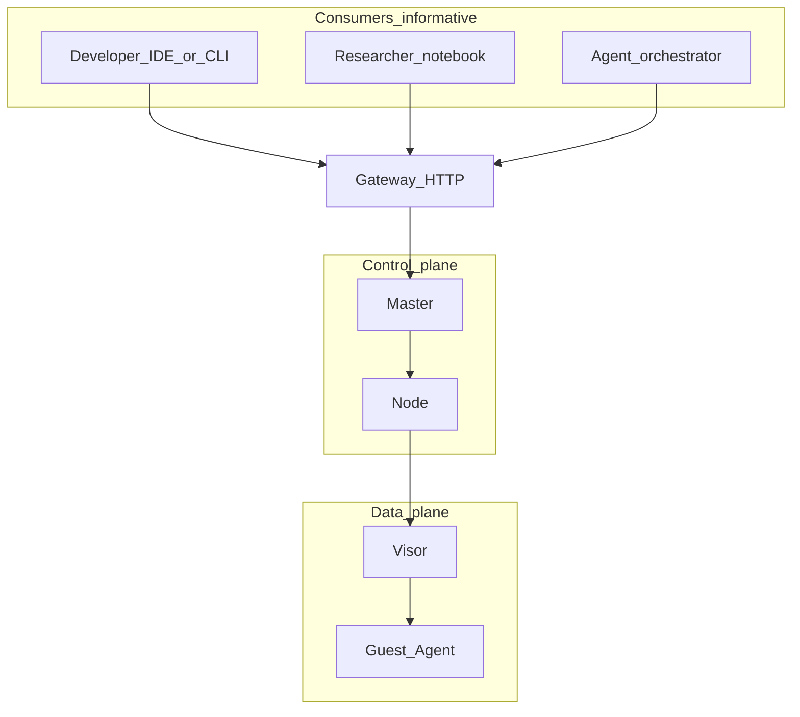
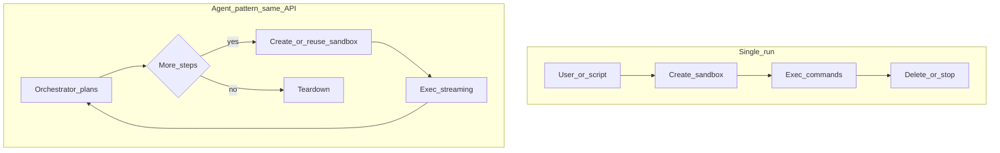

# Coco Sandbox – Use cases and consumers (informative)

**Scope:** Who uses Coco, for what, and how that maps to the normative spec—without duplicating API or security rules. This document is **informative**; behavior **MUST**s remain in the numbered files listed in `12-glossary-and-conventions.md` section 4.  
**Status:** Informative (not a second normative path).  
**Index:** [Specification index](index.md)

## 1. What Coco provides in common to every consumer

Every consumer, regardless of role, uses Coco for the same **core contract**: a **KVM-isolated** execution environment, a **documented control plane** (Gateway and related components), and **policy** for network, resources, and authentication when enabled. **Coco does not** define the end user’s product logic, ML models, or agent reasoning; it defines **isolation, lifecycle, and execution** primitives.

| Layer | In Coco (normative) | Out of scope (product-specific) |
|------|--------------------|----------------------------------|
| Isolation, VM, exec, network enforcement | `00`, `02`–`08` | How a UI or agent **chooses** what to run |
| API and errors | `02-api.md` | Client SDKs and frameworks |
| SLOs | `06-performance.md` | Your workload’s own latency SLOs |

## 2. Consumer categories and typical goals

These categories overlap; a single organization may play several roles.

| Category | Primary goal | Typical use of spec |
|----------|-------------|----------------------|
| **Product / platform developers** | Embed sandboxes in a product (SaaS, internal platform, IDE backend) | `02-api.md` for contract; `10` and `11` for deployment; `04` for threat review |
| **CI and test automation** | Reproducible, isolated test runs, parallel jobs | `02` (exec, lifecycle), `07` if multi-node, `05` for templates |
| **Researchers** | Reproducible **experiments**, same environment across runs, optional hibernate/checkpoint | `05` (state), `06` (SLO under load), `03` (network mode for off-line or limited egress) |
| **Operator / SRE** | Uptime, quotas, observability, change windows | `08`, `10`, `07` (cluster, drain), `09` (stack) |
| **Orchestrated “agent” stacks** | Run **tool-using** or long-running **automation** (planning, file edits, commands) in isolation | `02` for automation against the API; `03` and `04` to constrain egress and privilege; rest is **orchestrator** design |

Coco is explicitly aimed at **AI and code-execution** workloads in the product sense: see the executive summary in `00-overview.md`. That is a **positioning** statement, not a separate product mode in the API.

## 3. How autonomous and agent-style runtimes fit (e.g. OpenClaw-style, Hermes-style)

Some teams run **orchestrators** or **agent runtimes** that schedule work into sandboxes: they plan steps, call tools, read outputs, and loop. **Examples** in the community include stacks built around **OpenClaw**-class tooling or **Hermes**-style agent pipelines (naming is illustrative; exact products evolve independently of Coco).

For those systems, the division of labor is:

| Part | Where it usually lives | Coco spec to read |
|------|------------------------|-------------------|
| **Reasoning, tool selection, memory between turns** | Orchestrator / agent framework (not part of this spec) | n/a (your framework’s docs) |
| **“Run this command in an isolated environment”** | Your client calling Gateway | `02-api.md` |
| **Egress, secrets, and abuse limits** | Your policies + `03` + `04` + operator config | `03-network.md`, `04-security.md`, `10` |
| **Attaching identity / tenancy** | Your API keys, projects, billing | `02`, `10`, and your deployment |
| **Clients that resemble other hosted sandboxes** | Optional client patterns; contract is `02-api.md` | `02` §8 (informative) |

Coco is **a backend** for that pattern: the agent **runtime** (whatever software sits above) uses the same REST surface as a human-driven script. There is **no** separate “agent API” in this spec—only the same **resources and methods** with your client implementing the loop and policy.

## 4. How to choose a network and isolation mode by intent (informative)

| Intent | Suggested **direction** (not mandatory) | Spec |
|--------|----------------------------------------|------|
| **Maximum privacy / no exfil** | Tight or no egress; isolated mode for extreme cases | `03-network.md` (modes) |
| **Reproducible dev-like environment** | Bridge or tap with a narrow allow list | `03` |
| **Host–guest control only** | VSock mode where applicable | `03` |

## 5. Example use-case flows (Mermaid, informative)

These diagrams are **not** normative; they help readers compare **who** calls **what**. Only `02-api.md` and the other numbered specs define behavior. Mermaid is used **only in this file** in the `spec/` set for these illustrations.

### 5.1 All consumers share the same API surface

### 5.2 Human-driven run versus orchestrator loop (logical)

**Developer / researcher (typical):** one or a few create → exec → delete sequences. **Agent stack:** the same **Gateway** methods inside a **loop**; planning stays outside Coco.

## 6. Related reading (normative)

- [02-api.md](02-api.md) – what any consumer can call.  
- [10-self-hosting-and-operations.md](10-self-hosting-and-operations.md) – what operators own.  
- [12-glossary-and-conventions.md](12-glossary-and-conventions.md) – terms and **single source of truth** for requirements.  
- [14-deployment-topology-and-neutrality.md](14-deployment-topology-and-neutrality.md) – **neutral** Coco, spec as **current-only** text, **community worker** pattern (platform on top).

---

*This file does not introduce new **MUST**s; it orients readers. If a sentence here seems to add a hard requirement, treat it as a pointer until the same requirement appears in an authoritative spec file above. Mermaid in section 5 is illustrative; renderers that do not support Mermaid can rely on the tables in sections 1–4 instead.*
